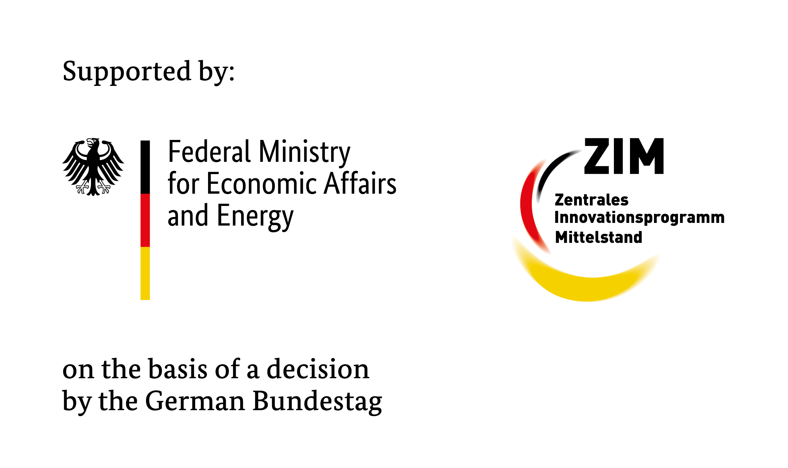

# CFDPredict

This repository contains test cases and workflows developed within the research project *CFDPredict*:

```
CFD- and data-based prediction and optimization of fluid mechanical devices in the cloud
```

The project is developed jointly by [DHCAE Tools GmbH](https://www.cfdtools.com/) and TU Dresden's [Institute of Fluid Mechanics](https://tu-dresden.de/ing/maschinenwesen/ism/psm/die-professur/beschaeftigte/weiner-andre).

## Overview

The repository is organised so that the CFD workflows (maintained by DHCAE Tools)
and the reduced-order-model / cloud-integration code (maintained by TU Dresden)
sit side by side without overlapping:

| Path | Owner | Content |
|------|-------|---------|
| `workflows/`   | DHCAE | parametric OpenFOAM test cases (A2 now, A3 to follow) |
| `tools/`       | DHCAE | headless runner `run_workflow.py` (CLI + Python API) |
| `examples/`    | DHCAE | ready-to-run settings (`*.json`) + Bayes-loop skeleton |
| `docs/`        | DHCAE | parameter schema, outputs, system requirements, authoring guide |
| `rom/`         | TU Dresden | reduced-order models |
| `integration/` | TU Dresden | Slurm / HPC / online-integration glue |

Currently included: test case **A2 – guide vanes in a 90° bend**, in two topologies
— `A2_leitbleche` (concentric "Mother" vanes, recommended for optimisation) and
`A2_brand_topology` (reproduction of Brand 2020, ch. 7). The pressure-swirl
atomiser case **A3** will be added after the first A2 feedback round.

Each workflow is self-contained and deterministic (blockMesh-based), suited to ROM
training and Bayesian optimisation. See `workflows/README.md` for details and
`docs/` for the parameter schema, outputs, and authoring conventions.

## Dependencies

- Linux x86_64, Python ≥ 3.10
- OpenFOAM ESI **v2512** (+ MPI; v2506 tested, v2406+ compatible)
- Python: `matplotlib` (A2 workflow). Bayes loop (TU Dresden side): `botorch`,
  `gpytorch`, `torch`, `numpy`, `scipy`.
- Optional: ParaView / `pvbatch` (report PNGs), `gnuplot`.

Full list and per-distribution notes: [`docs/SYSTEM_REQUIREMENTS.md`](docs/SYSTEM_REQUIREMENTS.md).

## How to run

Headless, from the repository root:

```bash
# A2 "Mother" baseline (3 concentric guide vanes)
python3 tools/run_workflow.py A2_leitbleche \
        examples/mother_default_3vane.json --name mother_default --timeout 1800

# without OpenFOAM (build the case directories only):  ... --dry-build --no-tail
# list all available workflows:                         python3 tools/run_workflow.py --list
```

Results land in `runs/<name>/`: the ParaView-openable case, `progress/summary.json`
(dP, vorticity, uniformity) + `summary.csv`, and `results/results.zip`.

OpenFOAM is auto-resolved at `/opt/OpenFOAM/OpenFOAM-v2512/etc/bashrc`; set the
environment variable `STREAMLIT_OPENFOAM_BASHRC` to a different bashrc if needed.

**On a Slurm cluster** the very same command runs unchanged inside an allocation —
wrap it with `sbatch` and set `STREAMLIT_OPENFOAM_BASHRC`. A reference batch script
is in [`integration/slurm/`](integration/slurm/). (Verified on a 2-node test
cluster: the workflow's `mpirun -np N` is picked up by the Slurm allocation as-is —
no `srun`/PMIx changes required, no modification to the workflow.)

## Research data

Large binary artefacts (meshes, full case data, validation datasets) are exchanged
out-of-band via the project cloud share, not stored in this repository.

## Funding


